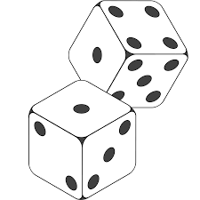

## What is Farkle?
  
##### Farkle is a dice game.  You roll six dice and receive a score based on the combination of spots.
  
 

--- .class #id 

## What are the rules?

##### After you count your points, you have the option to keep your points or roll again.  If you roll again and don't improve your score, you lose all your points.

--- .class #id 

## What does the app do?

##### The app has many great features.  It will score your game for you.  It will also tell you the expected value of your score if you choose to roll again, and also the probability that you will lose all your points.

--- .class #id 

## Where can I see it?

##### Visit https://dleonard.shinyapps.io/Farkle to see the app.  Sorry I didn't have enough time to embed interactive features into this presentation!
